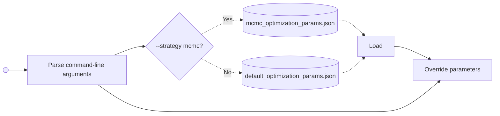

# 3D Gaussian Splatting for Real-Time Radiance Field Rendering - C++ and CUDA Implementation

[](https://discord.gg/TbxJST2BbC)
[](https://mrnerf.com)
[](https://mrnerf.github.io/awesome-3D-gaussian-splatting/)

A high-performance C++ and CUDA implementation of 3D Gaussian Splatting.


## 🏆 Competition (done)
Reduce training time by half and win **the $1500 prize**!  
Details here: [Issue #135](https://github.com/MrNeRF/gaussian-splatting-cuda/issues/135)

This competition is sponsored by [@vincentwoo](https://github.com/vincentwoo), [@mazy1998](https://github.com/mazy1998), and myself – each contributing **$300**. [@toshas](https://github.com/toshas) and [@ChrisAtKIRI](https://x.com/ChrisAtKIRI) are each contributing **$200**. Finally, [@JulienBlanchon](https://x.com/JulienBlanchon) and [Drew Moffitt](https://www.linkedin.com/in/drew-moffitt-gisp-0a4522157?utm_source=share&utm_campaign=share_via&utm_content=profile&utm_medium=ios_app) are each contributing **$100**.

Winning [pr](https://github.com/MrNeRF/gaussian-splatting-cuda/pull/245).

## Agenda (this summer)
1. Improve the viewer, i.e., better camera controls, more interactive features.
2. Migrate UI from Dear ImGui to [RmlUi](https://github.com/mikke89/RmlUi). (Well, let's see)
3. Support SuperSplat-like editing features, just more interactive.

Contributions are very welcome!

---
## 📰 News
Please open pull requests towards the dev branch. On dev, changes will be licensed as GPLv3. Once we have reached a new stable state on dev (the viewer will be improved as the next priority), we will merge back to master. The repo will then be licensed as GPLv3.

- **[2025-06-28]**: A docker dev container has arrived.
- **[2025-06-27]**: Removed submodules. Dependencies are now managed via vcpkg. This simplifies the build process and reduces complexity.
- **[2025-06-26]**: We have new sponsors adding each $200 for a total **$1300 prize pool**!

### LPIPS Model
The implementation uses `weights/lpips_vgg.pt`, which is exported from `torchmetrics.image.lpip.LearnedPerceptualImagePatchSimilarity` with:
- **Network type**: VGG
- **Normalize**: False (model expects inputs in [-1, 1] range)
- **Model includes**: VGG backbone with pretrained ImageNet weights and the scaling normalization layer

**Note**: While the model was exported with `normalize=False`, the C++ implementation handles the [0,1] to [-1,1] conversion internally during LPIPS computation, ensuring compatibility with images loaded in [0,1] range.

| Scene    | Iteration | PSNR          | SSIM         | LPIPS        | Num Gaussians |
| -------- | --------- | ------------- | ------------ | ------------ |---------------|
| garden   | 30000     | 27.538504     | 0.866146     | 0.148426     | 1000000       |
| bicycle  | 30000     | 25.771051     | 0.790709     | 0.244115     | 1000000       |
| stump    | 30000     | 27.141726     | 0.805854     | 0.246617     | 1000000       |
| bonsai   | 30000     | 32.586533     | 0.953505     | 0.224543     | 1000000       |
| counter  | 30000     | 29.346529     | 0.923511     | 0.223990     | 1000000       |
| kitchen  | 30000     | 31.840155     | 0.938906     | 0.141826     | 1000000       |
| room     | 30000     | 32.511021     | 0.938708     | 0.253696     | 1000000       |
| **mean** | **30000** | **29.533646** | **0.888191** | **0.211888** | **1000000**   |

For reference, here are the metrics for the official gsplat-mcmc implementation below. However, the
lpips results are not directly comparable, as the gsplat-mcmc implementation uses a different lpips model.

| Scene    | Iteration | PSNR          | SSIM         | LPIPS        | Num Gaussians |
| -------- | --------- | ------------- | ------------ | ------------ | ------------- |
| garden   | 30000     | 27.307266     | 0.854643     | 0.103883     | 1000000       |
| bicycle  | 30000     | 25.615253     | 0.774689     | 0.182401     | 1000000       |
| stump    | 30000     | 26.964493     | 0.789816     | 0.162758     | 1000000       |
| bonsai   | 30000     | 32.735737     | 0.953360     | 0.105922     | 1000000       |
| counter  | 30000     | 29.495266     | 0.924103     | 0.129898     | 1000000       |
| kitchen  | 30000     | 31.660593     | 0.935315     | 0.087113     | 1000000       |
| room     | 30000     | 32.265732     | 0.937518     | 0.132472     | 1000000       |
| **mean** | **30000** | **29.434906** | **0.881349** | **0.129207** | **1000000**   |

## Community & Support

Join our growing community for discussions, support, and updates:
- 💬 **[Discord Community](https://discord.gg/TbxJST2BbC)** - Get help, share results, and discuss development
- 🌐 **[mrnerf.com](https://mrnerf.com)** - Visit our website for more resources
- 📚 **[Awesome 3D Gaussian Splatting](https://mrnerf.github.io/awesome-3D-gaussian-splatting/)** - Comprehensive paper list and resources
- 🐦 **[@janusch_patas](https://twitter.com/janusch_patas)** - Follow for the latest updates

## Build and Execution Instructions

### Software Prerequisites
1. **Linux** (tested with Ubuntu 22.04+) or Windows
2. **CMake** 3.24 or higher
3. **C++23 compatible compiler** (GCC 14+ or Clang 17+)
4. **CUDA** 12.8 or higher (**Required**: CUDA 11.8 and lower are no longer supported)
5. **Python** with development headers
6. **LibTorch 2.7.0** - Setup instructions below
7. **vcpkg** for dependency management
8. Other dependencies are handled automatically by vcpkg

> **⚠️ Important**: This project now requires **CUDA 12.8+** and **C++23**. If you need to use older CUDA versions, please use an earlier release of this project.

### Hardware Prerequisites
1. **NVIDIA GPU** with CUDA support and compute capability 7.5+
- Successfully tested: RTX 4090, RTX A5000, RTX 3090Ti, A100, RTX 2060 SUPER
- Known issue with RTX 3080Ti on larger datasets (see #21)
2. **GPU Memory**: Minimum 8GB VRAM recommended for training

> If you successfully run on other hardware, please share your experience in the Discussions section!

### Build Instructions

#### Linux
```bash
# Set up vcpkg once
git clone https://github.com/microsoft/vcpkg.git
cd vcpkg && ./bootstrap-vcpkg.sh -disableMetrics && cd ..
export VCPKG_ROOT=/path/to/vcpkg # ideally should put this in ~/.bashrc to make it permanent

# Clone the repository
git clone https://github.com/MrNeRF/gaussian-splatting-cuda
cd gaussian-splatting-cuda

# Download and setup LibTorch 2.7.0 with CUDA 12.8 support
wget https://download.pytorch.org/libtorch/cu128/libtorch-cxx11-abi-shared-with-deps-2.7.0%2Bcu128.zip  
unzip libtorch-cxx11-abi-shared-with-deps-2.7.0+cu128.zip -d external/
rm libtorch-cxx11-abi-shared-with-deps-2.7.0+cu128.zip

# Build the project
cmake -B build -DCMAKE_BUILD_TYPE=Release -G Ninja
cmake --build build -- -j$(nproc)
```

#### Windows
Instructions must be run in **VS Developer Command Prompt** 
```bash
# Set up vcpkg once
git clone https://github.com/microsoft/vcpkg.git
cd vcpkg && .\bootstrap-vcpkg.bat -disableMetrics && cd ..
set VCPKG_ROOT=%CD%\vcpkg
# Note: Add VCPKG_ROOT to your system environment variables permanently via System Properties > Advanced > Environment Variables

# Clone the repository
git clone https://github.com/MrNeRF/gaussian-splatting-cuda
cd gaussian-splatting-cuda

# Download and setup LibTorch 2.7.0 with CUDA 12.8 support
# Create directories for debug and release versions (create directories if they don't exist)
if not exist external mkdir external
if not exist external\debug mkdir external\debug
if not exist external\release mkdir external\release

# LibTorch must be downloaded separately for debug and release in Windows
# Download and extract debug version
curl -L -o libtorch-win-shared-with-deps-debug-2.7.0+cu128.zip https://download.pytorch.org/libtorch/cu128/libtorch-win-shared-with-deps-debug-2.7.0%2Bcu128.zip
tar -xf libtorch-win-shared-with-deps-debug-2.7.0+cu128.zip -C external\debug
del libtorch-win-shared-with-deps-debug-2.7.0+cu128.zip

# Download and extract release version
curl -L -o libtorch-win-shared-with-deps-2.7.0+cu128.zip https://download.pytorch.org/libtorch/cu128/libtorch-win-shared-with-deps-2.7.0%2Bcu128.zip
tar -xf libtorch-win-shared-with-deps-2.7.0+cu128.zip -C external\release
del libtorch-win-shared-with-deps-2.7.0+cu128.zip

# Build the project
cmake -B build -DCMAKE_BUILD_TYPE=Release
cmake --build build --config Release -j

```
Note: Building in Debug mode requires building debug python libraries (python3*_d.dll, python3*_d.lib) separately.

### Troubleshooting Build Issues

#### Missing CUDA Libraries:
If you encounter CUDA library linking errors:
```bash
# Verify CUDA libraries exist
ls -la /usr/local/cuda-12.8/lib64/libcudart*
ls -la /usr/local/cuda-12.8/lib64/libcurand*
ls -la /usr/local/cuda-12.8/lib64/libcublas*

# Install missing development packages
sudo apt install cuda-cudart-dev-12-8 cuda-curand-dev-12-8 cuda-cublas-dev-12-8
```

#### C++23 Compiler Issues:
Ensure you have a modern compiler:

##### Ubuntu 24.04+:
```bash
# Check compiler version
gcc --version  # Should be 14+ for full C++23 support

# Install GCC 14 (Ubuntu 24.04+)
sudo apt update
sudo apt install gcc-14 g++-14 gfortran-14 # updating gfortran to 14 is not necessary for this project but compilation for other projects could break with gfortran still staying at 13 while gcc/g++ is 14

# Set as default
sudo update-alternatives --install /usr/bin/gcc gcc /usr/bin/gcc-14 60
sudo update-alternatives --install /usr/bin/g++ g++ /usr/bin/g++-14 60
sudo update-alternatives --install /usr/bin/gfortran gfortran /usr/bin/gfortran-14 60

# Select the gcc/g++-14
sudo update-alternatives --config gcc
sudo update-alternatives --config g++ 
sudo update-alternatives --config gfortran
```

##### Ubuntu 22.04:
GCC 14 must be built from source on Ubuntu 22.04:

```bash
# Install build dependencies
sudo apt update
sudo apt install build-essential
sudo apt install libmpfr-dev libgmp3-dev libmpc-dev -y

# Download and build GCC 14.1.0
wget http://ftp.gnu.org/gnu/gcc/gcc-14.1.0/gcc-14.1.0.tar.gz
tar -xf gcc-14.1.0.tar.gz
cd gcc-14.1.0

# Configure build (this may take several minutes)
./configure -v --build=x86_64-linux-gnu --host=x86_64-linux-gnu --target=x86_64-linux-gnu \
    --prefix=/usr/local/gcc-14.1.0 --enable-checking=release --enable-languages=c,c++ \
    --disable-multilib --program-suffix=-14.1.0

# Build GCC (this will take 1-2 hours depending on your system)
make -j$(nproc)

# Install GCC
sudo make install

# Set up alternatives to use the new GCC version
sudo update-alternatives --install /usr/bin/gcc gcc /usr/local/gcc-14.1.0/bin/gcc-14.1.0 14
sudo update-alternatives --install /usr/bin/g++ g++ /usr/local/gcc-14.1.0/bin/g++-14.1.0 14

# Verify installation
gcc --version
g++ --version
```

**Note**: Building GCC from source is time-intensive (1-2 hours). Consider using Ubuntu 24.04+ or Docker for faster setup if possible.

## LibTorch 2.7.0

This project uses **LibTorch 2.7.0** for optimal performance and compatibility:

- **Enhanced Performance**: Improved optimization and memory management
- **API Stability**: Latest stable PyTorch C++ API
- **CUDA 12.8 Support**: Full compatibility with modern CUDA versions
- **C++23 Features**: Leverages modern C++ features for better performance
- **Bug Fixes**: Resolved optimizer state management issues

> **Note**: Make sure to download the CUDA 12.8 compatible version of LibTorch as shown in the build instructions.

## Docker Build

This project also supports a Docker-based environment for simplified setup and reproducible builds with CUDA 12.8 support.

### Prerequisites
- [Docker](https://docs.docker.com/get-docker/)
- [Docker Compose](https://docs.docker.com/compose/)
- [NVIDIA Container Toolkit](https://docs.nvidia.com/datacenter/cloud-native/container-toolkit/install-guide.html)  
  (Required for GPU support)

### Basic Usage

To build and run the container, use the provided helper script:

```bash

# Build the Docker image (with cache)
./docker/run_docker.sh -b

# OR build without cache
./docker/run_docker.sh -n

# Start the container and enter it
./docker/run_docker.sh -u

# Stop and remove containers
./docker/run_docker.sh -c

# Build and start the Docker image with CUDA 12.8
./docker/run_docker.sh -bu 12.8.0
```

This will mount your current project directory into the container, enabling live development.  
GPU acceleration and GUI support (e.g., OpenGL viewers) are enabled if supported by your system.


### Upgrading from Previous Versions
1. **Update CUDA to 12.8+** if using an older version
2. **Update compiler to support C++23** (GCC 14+ or Clang 17+)
3. Download the new LibTorch version with CUDA 12.8 support using the build instructions
4. Clean your build directory: `rm -rf build/`
5. Rebuild the project

## Dataset

Download the dataset from the original repository:
[Tanks & Trains Dataset](https://repo-sam.inria.fr/fungraph/3d-gaussian-splatting/datasets/input/tandt_db.zip)

Extract it to the `data` folder in the project root.

## Configuration

The configuration is determined by command-line arguments and JSON files located in the `parameter/` directory.



## Command-Line Options

### Required Options

- **`-d, --data-path [PATH]`**  
  Path to the training data containing COLMAP sparse reconstruction (required)

### Output Options

- **`-o, --output-path [PATH]`**  
  Path to save the trained model (default: `./output`)

### Training Options

- **`-i, --iter [NUM]`**  
  Number of training iterations (default: 30000)
  - Paper suggests 30k, but 6k-7k often yields good preliminary results
  - Outputs are saved every 7k iterations and at completion

- **`-r, --resolution [NUM]`**  
  Set the resolution for training images
  - -1: Use original resolution (default)
  - Positive values: Target resolution for image loading

- **`--steps-scaler [NUM]`**  
  Scale all training steps by this factor (default: 1)
  - Multiplies iterations, refinement steps, and evaluation/save intervals
  - Creates multiple scaled checkpoints for each original step

- **`--strategy [STRATEGY]`**  
  Optimization strategy to use (default: `mcmc`)
  - Options: `mcmc`, `default`

### MCMC-Specific Options

- **`--max-cap [NUM]`**  
  Maximum number of Gaussians for MCMC strategy (default: 1000000)
  - Controls the upper limit of Gaussian splats during training
  - Useful for memory-constrained environments

### Default Strategy-Specific Options

- **`--prune_opacity [NUM]`**  
  Gaussians with opacity below this threshold will be pruned (default: 0.005)
  - Also used to determine the threshold for opacity reset

- **`--grow_scale3d [NUM]`**  
  Multiplier of the scene scale used to decide growth behavior (default: 0.01)
  - A higher value leads to more duplicates
  - A smaller value leads to more splits

- **`--grow_scale2d [NUM]`**  
  Gaussians with radius above this value will be split (default: 0.05)

- **`--prune_scale3d [NUM]`**  
  Multiplier of the scene scale used to decide pruning behavior (default: 0.1)
  - Gaussians with scale below the scene scale multiplied by this value will be pruned

- **`--prune_scale2d [NUM]`**  
  Gaussians with radius above this value will be pruned (default: 0.15)

- **`--stop_refine_scale2d [NUM]`**  
  Stop refining Gaussians based on radius after this iteration (default: 0)

- **`--reset_every [NUM]`**  
  Reset opacity every N-th iteration (default: 3000)
  - Pruning based on scale and radius starts only after `iter > reset_every`

- **`--pause_refine_after_reset [NUM]`**  
  Pause refining Gaussians until this number of steps after reset (default: 0)

- **`--revised_opacity`**  
  Whether to use revised opacity heuristic from arXiv:2404.06109 (default: false)

### Dataset Configuration

- **`--images [FOLDER]`**  
  Images folder name (default: `images`)
  - Options: `images`, `images_2`, `images_4`, `images_8`
  - Mip-NeRF 360 dataset uses different resolutions

- **`--test-every [NUM]`**  
  Every N-th image is used as a test image (default: 8)
  - Used for train/validation split

### Evaluation Options

- **`--eval`**  
  Enable evaluation during training
  - Computes metrics (PSNR, SSIM, LPIPS) at specified steps
  - Evaluation steps defined in `parameter/optimization_params.json`

- **`--save-eval-images`**  
  Save evaluation images during training
  - Requires `--eval` to be enabled
  - Saves comparison images and depth maps (if applicable)

### Render Mode Options

- **`--render-mode [MODE]`**  
  Render mode for training and evaluation (default: `RGB`)
  - `RGB`: Color only
  - `D`: Accumulated depth only
  - `ED`: Expected depth only
  - `RGB_D`: Color + accumulated depth
  - `RGB_ED`: Color + expected depth

### Visualization Options

- **`--headless`**  
  Enable the Visualization mode
  - Displays the current state of the Gaussian splatting in a window
  - Useful for debugging and monitoring training progress

### Advanced Options

- **`--bilateral-grid`**  
  Enable bilateral grid for appearance modeling
  - Helps with per-image appearance variations
  - Adds TV (Total Variation) regularization

- **`--sh-degree-interval [NUM]`**  
  Interval for increasing spherical harmonics degree
  - Controls how often SH degree is incremented during training

- **`-h, --help`**  
  Display the help menu

### Example Usage

Basic training:
```bash
./build/gaussian_splatting_cuda -d /path/to/data -o /path/to/output
```

MCMC training with limited Gaussians:
```bash
./build/gaussian_splatting_cuda -d /path/to/data -o /path/to/output --max-cap 500000
```

Training with evaluation and custom settings:
```bash
./build/gaussian_splatting_cuda \
    -d data/garden \
    -o output/garden \
    --images images_4 \
    --test-every 8 \
    --eval \
    --save-eval-images \
    --render-mode RGB_D \
    -i 30000
```

Force overwrite existing output:
```bash
./build/gaussian_splatting_cuda -d data/garden -o output/garden -f
```

Training with step scaling for multiple checkpoints:
```bash
./build/gaussian_splatting_cuda \
    -d data/garden \
    -o output/garden \
    --steps-scaler 3 \
    -i 10000
```

## Configuration Files

The implementation uses JSON configuration files located in the `parameter/` directory:

### `{strategy}_optimization_params.json`
Controls training hyperparameters including:
- Learning rates for different components
- Regularization weights
- Refinement schedules
- Evaluation and save steps
- Render mode settings
- Bilateral grid parameters

Key parameters can be overridden via command-line options.

## Contribution Guidelines

We welcome contributions! Here's how to get started:

1. **Getting Started**:
- Check out issues labeled as **good first issues** for beginner-friendly tasks
- For new ideas, open a discussion or join our [Discord](https://discord.gg/TbxJST2BbC)

2. **Development Requirements**:
- **C++23** compatible compiler (GCC 14+ or Clang 17+)
- **CUDA 12.8+** for GPU development
- Follow the build instructions above

3. **Before Submitting a PR**:
- Apply `clang-format` for consistent code style
- Use the pre-commit hook: `cp tools/pre-commit .git/hooks/`
- Discuss new dependencies in an issue first - we aim to minimize dependencies
- Ensure your changes work with both Debug and Release builds

## Acknowledgments

This implementation builds upon several key projects:

- **[gsplat](https://github.com/nerfstudio-project/gsplat)**: We use gsplat's highly optimized CUDA rasterization backend, which provides significant performance improvements and better memory efficiency.

- **Original 3D Gaussian Splatting**: Based on the groundbreaking work by Kerbl et al.

## Citation

If you use this software in your research, please cite the original work:

```bibtex
@article{kerbl3Dgaussians,
  author    = {Kerbl, Bernhard and Kopanas, Georgios and Leimkühler, Thomas and Drettakis, George},
  title     = {3D Gaussian Splatting for Real-Time Radiance Field Rendering},
  journal   = {ACM Transactions on Graphics},
  number    = {4},
  volume    = {42},
  month     = {July},
  year      = {2023},
  url       = {https://repo-sam.inria.fr/fungraph/3d-gaussian-splatting/}
}
```

## License

See LICENSE file for details.

---

**Connect with us:**
- 🌐 Website: [mrnerf.com](https://mrnerf.com)
- 📚 Papers: [Awesome 3D Gaussian Splatting](https://mrnerf.github.io/awesome-3D-gaussian-splatting/)
- 💬 Discord: [Join our community](https://discord.gg/TbxJST2BbC)
- 🐦 Twitter: Follow [@janusch_patas](https://twitter.com/janusch_patas) for development updates
