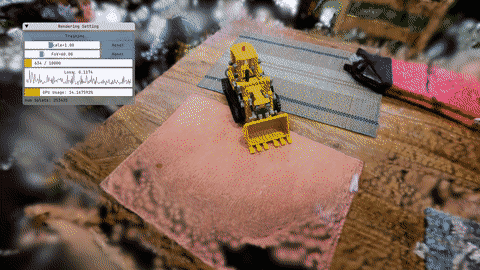

<div align="center"></div>

<div align="center">
**A high-performance C++ and CUDA implementation of 3D Gaussian Splatting**

[](https://discord.gg/TbxJST2BbC)
[](https://mrnerf.github.io/lichtfeld-studio-web/)
[](https://mrnerf.github.io/awesome-3D-gaussian-splatting/)
[](LICENSE)
[](https://developer.nvidia.com/cuda-downloads)
[](https://en.cppreference.com/w/cpp/23)



[**Quick Start**](#quick-start) •
[**Installation**](#installation) •
[**Usage**](#usage) •
[**Results**](#benchmark-results) •
[**Community**](#community--support)

</div>

---

## Support LichtFeld Studio Development

LichtFeld Studio is a free, open-source implementation of 3D Gaussian Splatting that pushes the boundaries of real-time rendering performance.

**Why Your Support Matters**:
This project requires significant time and resources to develop and maintain. 

Unlike commercial alternatives that can cost thousands in licensing fees, LichtFeld Studio remains completely free and open. Your contribution helps ensure it stays that way while continuing to evolve with the latest research.

Whether you're using it for research, production, or learning, your support enables us to dedicate more time to making LichtFeld Studio faster, more powerful, and accessible to everyone in the 3D graphics community.

[](https://paypal.me/MrNeRF)
[](https://donorbox.org/lichtfeld-studio)

---

## Overview

LichtFeld Studio is a high-performance implementation of 3D Gaussian Splatting that leverages modern C++23 and CUDA 12.8+ for optimal performance. Built with a modular architecture, it provides both training and real-time visualization capabilities for neural rendering research and applications.

### Key Features

- **2.4x faster rasterization** (winner of first bounty by Florian Hahlbohm)
- **MCMC optimization strategy** for improved convergence
- **Real-time interactive viewer** with OpenGL rendering
- **Modular architecture** with separate core, training, and rendering components
- **Multiple rendering modes** including RGB, depth, and combined views
- **Bilateral grid appearance modeling** for handling per-image variations

## Community & Support

Join our growing community for discussions, support, and updates:

- **[Discord Community](https://discord.gg/TbxJST2BbC)** - Get help, share results, and discuss development
- **[LichtFeld Studio FAQ](docs/docs/faq.md)** - Frequently Asked Questions about LichtFeld Studio
- **[Website](https://mrnerf.com)** - Visit our website for more resources
- **[Awesome 3D Gaussian Splatting](https://mrnerf.github.io/awesome-3D-gaussian-splatting/)** - Comprehensive paper list
- **[@janusch_patas](https://twitter.com/janusch_patas)** - Follow for the latest updates

## Active Bounties

### Fourth Bounty: Automatic Per-Scene Hyperparameter Optimization
**💰 $2,430** | [Issue #443](https://github.com/MrNeRF/LichtFeld-Studio/issues/443)  
**📅 Deadline:** October 12, 2025 at 11:59 PM PST

### Third Bounty: Follow-up to Bounty #002
**💰 $500** | [Issue #421](https://github.com/MrNeRF/LichtFeld-Studio/issues/421)  
**📅 Deadline:** None (open-ended)

## Installation
See wiki

## Contributing

We welcome contributions! See our [Contributing Guidelines](CONTRIBUTING.md).

### Getting Started
- Check issues labeled **good first issue**
- Join our [Discord](https://discord.gg/TbxJST2BbC) for discussions
- Use the pre-commit hook: `cp tools/pre-commit .git/hooks/`


## Acknowledgments

This implementation builds upon:
- **[gsplat](https://github.com/nerfstudio-project/gsplat)** - Optimized CUDA rasterization backend
- **[3D Gaussian Splatting](https://repo-sam.inria.fr/fungraph/3d-gaussian-splatting/)** - Original work by Kerbl et al.

## Citation

```bibtex
@software{lichtfeld2025,
  author    = {LichtFeld Studio},
  title     = {A high-performance C++ and CUDA implementation of 3D Gaussian Splatting},
  year      = {2025},
  url       = {https://github.com/MrNeRF/LichtFeld-Studio}
}
```

## License

This project is licensed under GPLv3. See [LICENSE](LICENSE) for details.

---

<div align="center">

**Connect with us:** [Website](https://mrnerf.com) • [Discord](https://discord.gg/TbxJST2BbC) • [Twitter](https://twitter.com/janusch_patas)

</div>
